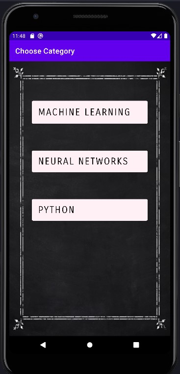
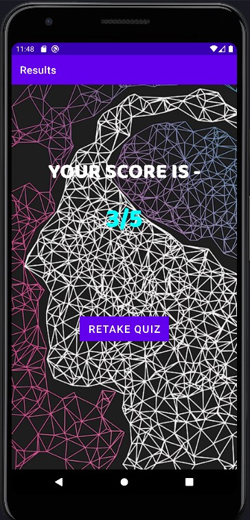

# QuizWorld
This is a mobile application. It is for quiz practice. It has quizzes on various topics like machine learning, neural networks, etc. The queztions are true and false based and it shows the score when answers are submitted.

### Location Of Apk
```
"path_to_this_folder"\QuizWorld-mobile-quiz-application\app\build\intermediates\apk\debug\QuizWorld.apk""
```

### Screenshots
      
